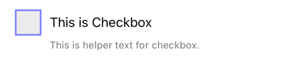
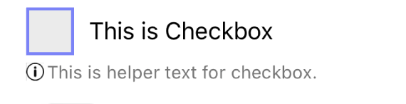

# Checkbox
<table >
   <tr>
      <td></td>
      <td></td>
      <td></td>
  </tr>
</table>

## Usage

```js
import React, { useState } from 'react-native';
import { Checkbox } from '@pbsc/react-native-ui-components';

const [checked, setChecked] = useState(false);

// ...

const handleCheckboxChange = (value) => {
    setChecked(value);
};

// ...

<Checkbox
    label="This is Checkbox"
    checked={checked}
    onChange={handleCheckboxChange}
    helperText="This is helper text for checkbox."
    hasHelperTextIcon={true}
        helperTextCustomIcon={
        <Image
            source={require('../images/info.png')}
            style={{ width: 12, height: 12, marginTop: 5 }}
        />
        }
/>
```

## Props
### label
Type: string <br/>
The text to use for the label.

### checked
Type: boolean <br/>
Default value: false <br/>
Whether the Checkbox is checked or not. If `true` the Checkbox will be turned on

### onChange
Type: function <br/>
Callback that is called when the Checkbox's status changes. (checked -> unchecked or vice versa)

### helperText
Type: string <br/>
Text for additional info.

### disabled
Type: boolean <br/>
Default value: false <br/>
If `true`, user won't be able to interact with the component.

### width
Type: string/number <br/>
Default value: '80%' <br/>
Set the width of the Checkbox including its label

### size
Type: number <br/>
Default value: 32
Set the size of the Checkbox

### borderWidth
Type: number <br />
Default value: 2
Set the width of the Checkbox's border

### borderColor
Type: hexColorCode (ex: #ff00ff) <br/>
Default value: #7a81ff <br/>
Border color of the Checkbox

### backgroundColorUnchecked
Type: hexColorCode (ex: #ff00ff) <br/>
Default value: #ebebeb <br/>
Background color when the Checkbox is unchecked.

### backgroundColorChecked
Type: hexColorCode (ex: #ff00ff) <br/>
Default value: #7a81ff <br/>
Background color when the Checkbox is checked.

### checkmarkColor
Type: hexColorCode (ex: #ff00ff) <br/>
Default value: #ffffff <br/>
Checkmark's color

### labelColor
Type: hexColorCode (ex: #ff00ff) <br/>
Default value: #000000 <br/>
Label's color

### style
Type: object <br/>
Set style of checkbox part

### labelStyle
Type: object <br/>
Set style of label part

### helperTextStyle
Type: object <br/>
Set style of helper text part

### hasHelperTextIcon
Type: boolean <br/>
Enable custom component (ex: helperTextCustomIcon) to place before helperText

### helperTextCustomIcon
Type: jsx component <br/>
A custom component (usually svg component or Image) to place icon before helperText and can be used for errors as well.
