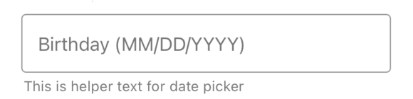
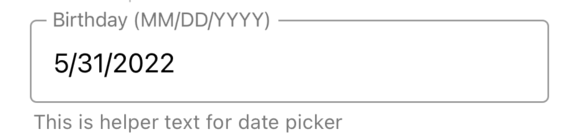
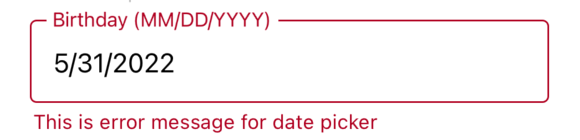
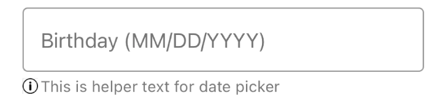
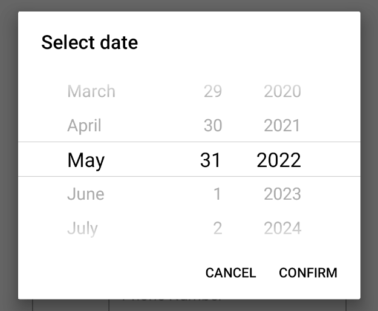
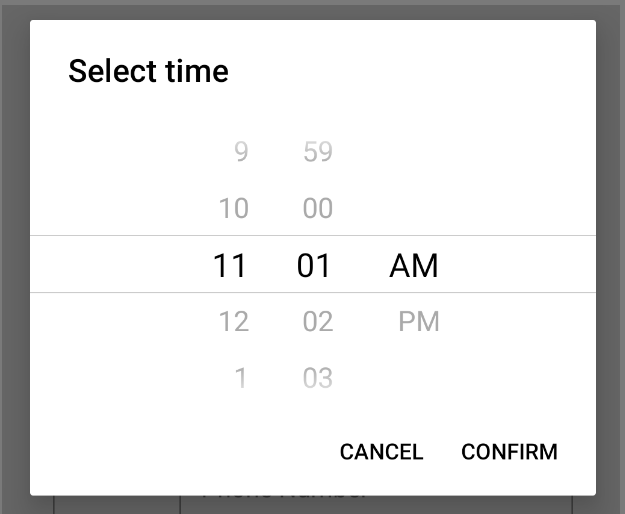
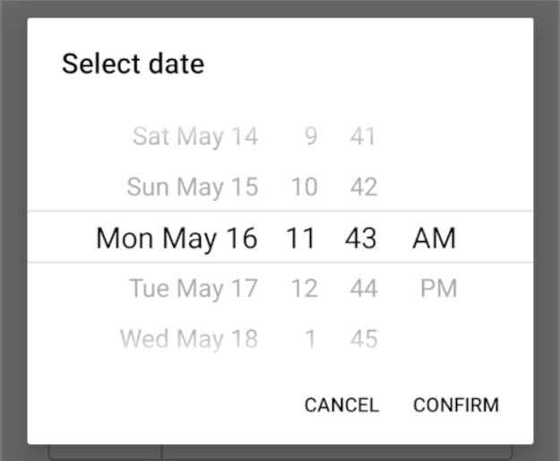
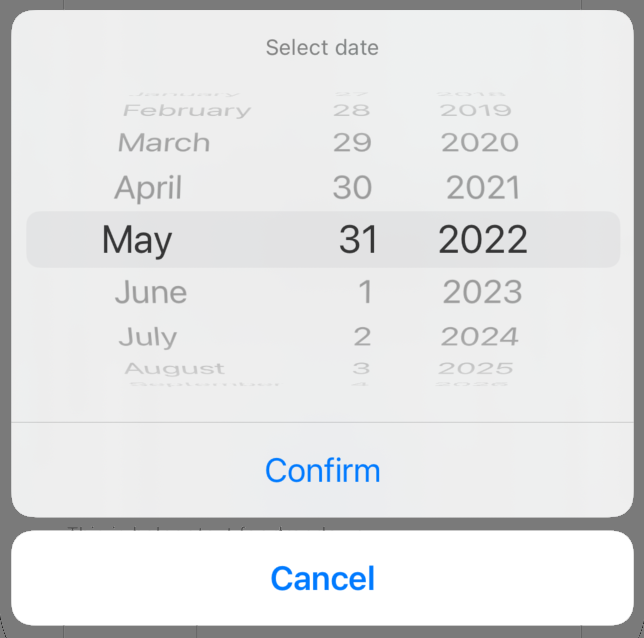
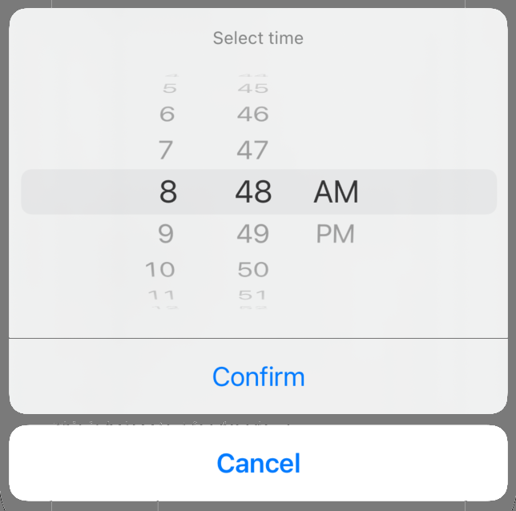
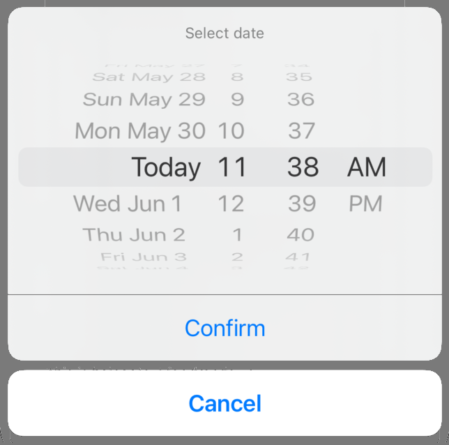

# DateTimePicker
- When picker is closed
<table >
   <tr>
      <td></td>
      <td></td></td>
      <td></td>
      <td></td>
  </tr>
</table>

- When picker(spinner) is open
<table >
   <tr>
      <td></td>
      <td align="center">date</td>
      <td align="center">time</td>
      <td align="center">datetime</td>
  </tr>
   <tr>
      <td align="center">Android</td>
      <td></td>
      <td></td>
      <td></td>
  </tr>
  <tr>
      <td align="center">iOS</td>
      <td></td>
      <td></td>
      <td></td>
  </tr>
</table>

## Usage

```js
import React, { useState } from 'react-native';
import { DateTimePicker } from '@pbsc/react-native-ui-components';

const [dateTimePickerSelectd, setDateTimePickerSelected] =
    useState(undefined);

// ...

const handleDateTimePickerConfirm = (selectedDateTime) => {
    setDateTimePickerSelected(selectedDateTime);
};

// ...

<DateTimePicker
    label="Birthday"
    labelWithFormat
    locale="en"
    mode="date"
    onConfirm={handleDateTimePickerConfirm}
    helperText="This is helper text for date picker"
    hasHelperTextIcon={true}
        helperTextCustomIcon={
        <Image
            source={require('../images/info.png')}
            style={{ width: 12, height: 12, marginTop: 5 }}
        />
        }
/>
```

## Props
### label
Type: string <br/>
The text to use for the floating label.

### labelWithFormat
Type: boolean <br/>
Default value: false <br/>
When `true`, date time format is shown in label.

### value
Type: string <br/>
Default Date: false <br/>
The currently selected date

### onConfirm
Type: function <br/>
Callback that is called when the Checkbox's status changes. (checked -> unchecked or vice versa)
Callback with selected date when user clicks confirm button

### onCancel
Type: function <br/>
Callback for when user clicks cancel button or closing the modal by clicking outside it.

### hasError
Type: boolean <br/>
Default value: false <br/>
When it is `true`, the DateTimePicker shows up with error style. (The color of the DateTimePicker and its helper text turns to error color)

### errorColor
Type: hexColorCode (ex: #ff00ff) <br/>
Default value: #b00020 <br/>
Color for error state

### helperText
Type: string <br/>
Text for additional info.  Can be used to show error message with `hasError` prop.

### disabled
Type: boolean <br/>
Default value: false <br/>
If `true`, user won't be able to interact with the component.

### mode
Type: enum (string) <br/>
Default value: 'date'
Mode for the DateTimePicker. `datetime`, `date`, `time`

### maximumValue
Type: Date <br/>
Maximum selectable date.  Example: new Date("2021-12-31")

### minimumValue
Type: Date <br/>
Minimum selectable date.  Example: new Date("2021-01-01")

### minInterval
Type: number <br/>
The interval at which minutes can be selected.

### locale
Type: string (locale id) <br/>
The locale for the date picker. Changes language, date order and am/pm preferences. Value needs to be a Locale ID.

### pickerTitleText
Type: string <br/>
Title text for the picker modal.

### confirmText
Type: string <br/>
Confirm button title.

### cancelText,
Type: string <br/>
Cancle button title.

### pickerTextColor
Type: hexColorCode (ex: #ff00ff) <br/>
Changes the text color. ⚠ Colors other than black (#000000) or white (#ffffff) will replace the "Today" string with a date on iOS 13 or higher. (iOS only)

### is24hour
Type: boolean <br/>
Change how the 24h mode (am/pm) should be determined, by device settings or by locale. {'locale', 'device'} (android only, default: 'device')

### width
Type: string/number <br/>
Default value: '80%' <br/>
Set the width of the DateTimePicker

### height
Type: string/number <br/>
Default value: 48
Set the height of the DateTimePicker

### backgroundColor
Type: hexColorCode (ex: #ff00ff) <br/>
Default value: #ffffff <br/>
Background color when the Checkbox is unchecked.    

### borderColor
Type: hexColorCode (ex: #ff00ff) <br/>
Default value: #9a9a9a <br/>
Border color of the DateTimePicker

### style
Type: object <br/>
Set style of container part

### fieldStyle
Type: object <br/>
Set style of field part

### helperTextStyle
Type: object <br/>
Set style of helper text part

### hasHelperTextIcon
Type: boolean <br/>
Enable custom component (ex: helperTextCustomIcon) to place before helperText

### helperTextCustomIcon
Type: jsx component <br/>
A custom component (usually svg component or Image) to place icon before helperText and can be used for errors as well.
