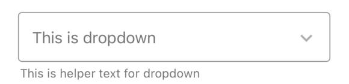
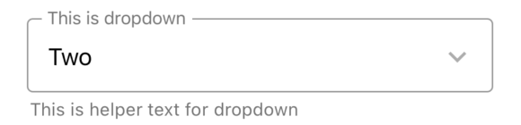
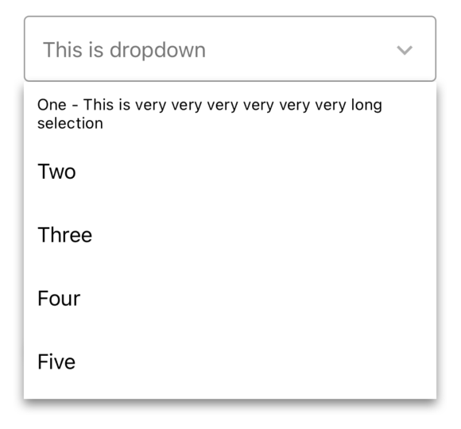
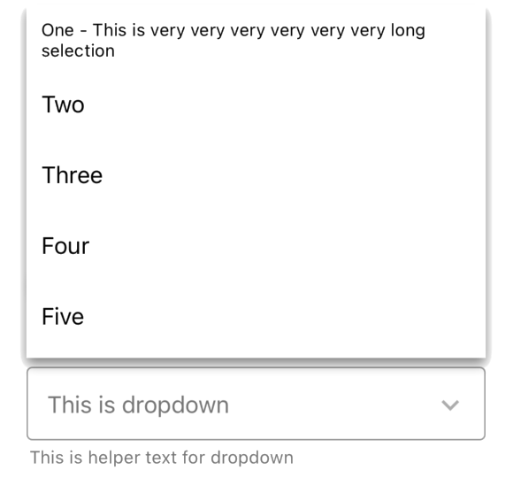

# Dropdown
- When menu is closed
<table >
   <tr>
      <td></td>
      <td></td>
  </tr>
</table>

- When menu is open
<table >
   <tr>
      <td></td>
      <td></td></td>
  </tr>
</table>

## Usage

```js
import React, { useState } from 'react-native';
import { Dropdown } from '@pbsc/react-native-ui-components';

const [dropdownSelected, setDropdownSelected] = useState(undefined);
const dropdownData = [
    {
      label: 'One - This is very very very very very very long selection',
      value: '1',
    },
    { label: 'Two', value: '2' },
    { label: 'Three', value: '3' },
    { label: 'Four', value: '4' },
    { label: 'Five', value: '5' },
];

// ...

const handleDropdownSelect = (selectedItem) => {
    setDropdownSelected(selectedItem);
    console.log(`Dropdown selected: ${selectedItem.value}`);
  };

// ...

<Dropdown
    label="This is dropdown"
    data={dropdownData}
    value={dropdownSelected}
    onSelect={handleDropdownSelect}
    helperText="This is helper text for dropdown"
/>
```

## Props
### label
Type: string <br/>
The text to use for the floating label.

### value
Type: object (type of an element of data for the Dropdown) <br/>
State variable that specifies the value of the selected item.

### items
Type: array of objects (each object has `label` and `value`) <br/>
State variable that holds the items for the Dropdown.

### textAlignInItem
Type: enum (string) <br/>
Default value: 'left' <br/>
Text alignment for each dropdown item.

### onSelect
Type: function <br/>
Callback that returns the selected item.

### helperText
Type: string <br/>
Text for additional info.

### showValueWhenSelected
Type: boolean <br/>
Default value: false <br/>
If `true` selected `value` is shown instead of `label`.

### disabled
Type: boolean <br/>
Default value: false <br/>
If `true`, user won't be able to interact with the component.

### width
Type: string/number <br/>
Default value: '80%' <br/>
Set the width of the Dropdown

### height
Type: string/number <br/>
Default value: 48
Set the height of the Dropdown

### backgroundColor
Type: hexColorCode (ex: #ff00ff) <br/>
Default value: #ffffff <br/>
Background color for the Dropdown.

### borderColor
Type: hexColorCode (ex: #ff00ff) <br/>
Default value: #9a9a9a <br/>
Border color of the Dropbox

### textColor
Type: hexColorCode (ex: #ff00ff) <br/>
Default value: #000000 <br/>
Text color of the Dropbox.

### textSize
Type: number <br/>
Default value: 16
Text size (fontSize) of the Dropbox

### style
Type: object <br/>
Set style of container part

### fieldStyle
Type: object <br/>
Set style of dropdown field part

### helperTextStyle
Type: object <br/>
Set style of helper text part
