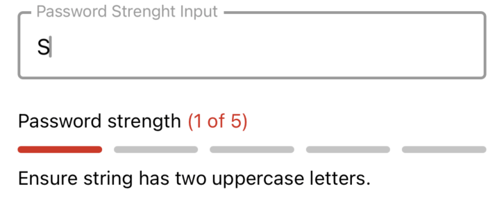
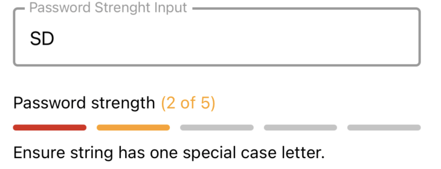
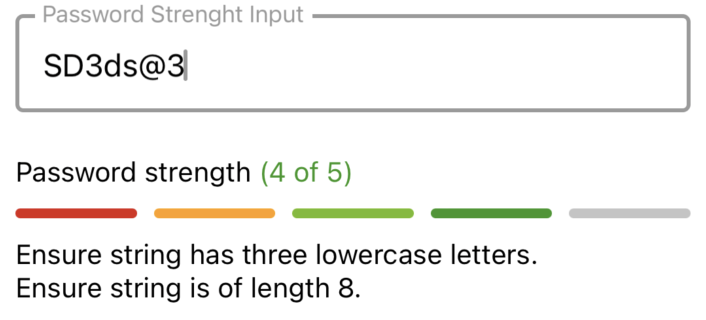
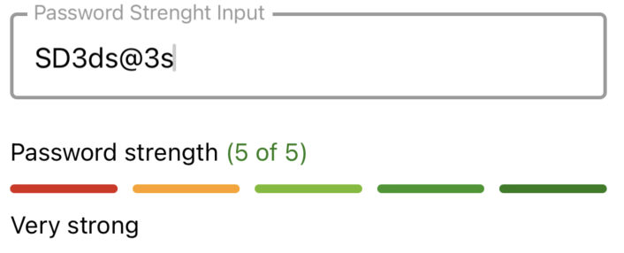

# PasswordStrength
<table>
   <tr>
      <td></td>
      <td></td>
      <td></td>
      <td></td>
      <td></td>
      <td></td>
  </tr>
</table>

## Usage

```js
import React, { useState } from 'react';
import { PasswordStrength } from '@pbsc/react-native-ui-components';

// ...

const [passwordStrengthValue, setPasswordStrengthValue] = useState('');
const [passwordStrengthValidation, setPasswordStrengthValidation] = useState(
    {}
);

const validateInputStrenghtApi = async (value) => {
    setPasswordStrengthValue(value);

    // Fonction or Api that return the strength
    const passwordWeakness = StrengthChecker(value);

    setPasswordStrengthValidation(passwordWeakness);
};

// ...

<TextField
    label="Password Strenght Input"
    value={passwordStrengthValue}
    onChangeText={validateInputStrenghtApi}
/>
<PasswordStrength
    value={passwordStrengthValue}
    isValid={() => {}}
    passwordStrengthValidation={passwordStrengthValidation}
/>
```

## Props
### value
Type: string <br/>
The text typed in the textfield.

### isValid
Type: boolean <br/>
Return true if the value entered is valid

### passwordStrengthValidation
Type: object <br/>
A object that contain the current validation based on the text entered in the textField
Value for strength: "VERY_STRONG", "STRONG", "GOOD", "FAIR", "WEAK".
Suggestions: Text to specify how to get a higher password strength

// ...
{
    valid: true,
    strength: 'VERY_STRONG',
    warning: '',
    suggestions: ['Very strong'],
};
```
