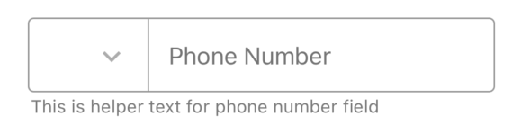
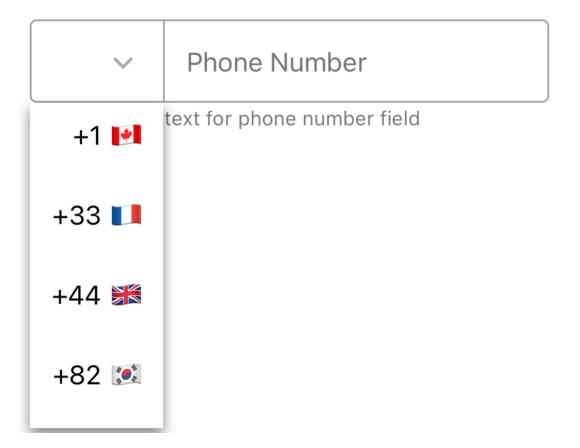
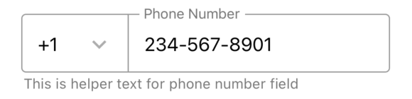
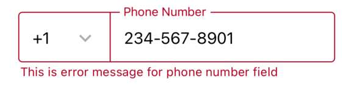
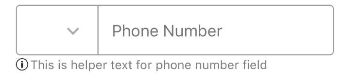

# PhoneNumberField

<table >
   <tr>
      <td valign="top"></td>
      <td valign="top"></td>
      <td valign="top"></td>
      <td valign="top"></td>
      <td></td>
  </tr>
</table>

## Usage

```js
import React, { useState } from 'react-native';
import { Checkbox } from '@pbsc/react-native-ui-components';

const [phoneNumber, setPhoneNumber] = useState('');
const prefiexesForPhoneNumber = [
  { label: '+1 🇨🇦', value: '+1' },
  { label: '+33 🇫🇷', value: '+33' },
  { label: '+44 🇬🇧', value: '+44' },
  { label: '+82 🇰🇷', value: '+82' },
  { label: '+672 🇳🇫', value: '+672' },
];

// ...

const handlePhoneFieldSubmitEditting = (value) => {
  setPhoneNumber(value);
  console.log(`Phonenumber: ${value}`);
};

// ...

<PhoneNumberField
  label="Phone Number"
  prefixes={prefiexesForPhoneNumber}
  helperText="This is helper text for phone number field"
  onSubmitEditing={handlePhoneFieldSubmitEditting}
  hasHelperTextIcon={true}
        helperTextCustomIcon={
          <Image
            source={require('../images/info.png')}
            style={{ width: 12, height: 12 }}

          />
        }
/>;
```

## Props

### label

Type: string <br/>
The text to use for the floating label.

### prefixes

Type: array of objects (each object has `label` and `value`)
Internatial country calling codes for dropdown part

### onSelectPrefix

Type: Function <br/>
Callback that is called when the prefix is selected.

### onChangeText

Type: Function <br/>
Callback that is called when the text in input area is changed.

### onSubmitEditing

Type: Function <br/>
Callback that is called when the submit button (enter button on the keyboard) is clicked.

### disabled

Type: boolean <br/>
Default value: false <br/>
If `true`, user won't be able to interact with the component.

### width

Type: string/number <br/>
Default value: '80%' <br/>
Set the width of the PhoneNumberField

### height

Type: string/number <br/>
Default value: 48
Set the heigh of the PhoneNumberField

### hasError

Type: boolean <br/>
Default value: false <br/>
When it is `true`, the PhoneNumberField shows up with error style. (The color of the PhoneNumberField and its helper text turns to error color)

### errorColor

Type: hexColorCode (ex: #ff00ff) <br/>
Default value: #b00020 <br/>
Color for error state

### textColor

Type: hexColorCode (ex: #ff00ff) <br/>
Default value: #000000 <br/>
Label's color

### textSize

Type: number <br/>
Default value: 16
Label's text size (fontSize)

### helperText

Type: string <br/>
Text for additional info. Can be used to show error message with `hasError` prop.

### helperText

Type: string <br/>
Text for additional info. Can be used to show error message with `hasError` prop.

### style

Type: object <br/>
Set style of container part

### prefixStyle

Type: object <br/>
Set style of prefix dropdown part

### fieldStyle

Type: object <br/>
Set style of textfield part

### helperTextStyle

Type: object <br/>
Set style of helper text part

### hasHelperTextIcon
Type: boolean <br/>
Enable custom component (ex: helperTextCustomIcon) to place before helperText

### helperTextCustomIcon
Type: jsx component <br/>
A custom component (usually svg component or Image) to place icon before helperText and can be used for errors as well.
