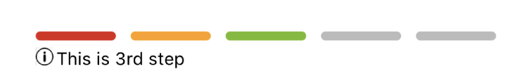

# StepIndicator

<table >
   <tr>
      <td></td>
      <td></td>
      <td></td>
      <td></td>
  </tr>
</table>

## Usage

```js
import { StepIndicator } from '@pbsc/react-native-ui-components';

// ...

const steps = [
  { color: '#dd2618', text: 'This is 1st step' },
  { color: '#fea112', text: 'This is 2nd step' },
  { color: '#76bc23', text: 'This is 3rd step' },
  { color: '#349822', text: 'This is 4th step' },
  { color: '#297d19', text: 'This is 5th step' },
];

const textBeforeStart = 'It is not started yet';

// ...

<StepIndicator
  steps={steps}
  textBeforeStart={textBeforeStart}
  currentStepIndex={3}
  hasHelperTextIcon={true}
  helperTextCustomIcon={
    <Image
        source={require('../images/info.png')}
        style={{ width: 12, height: 12, marginTop: 5 }}
    />
  }
/>;
```

## Props

### steps
Type: array of objects. (each object has `color` and `text`) <br/>
State variable that holds color and text for each step.

### textBeforeStart
Type: string <br/>
Text showing before starting (when `currentStepIndex` is below 0). If this isn't provided, no text is shown.

### currentStepIndex
Type: number <br/>
Default value: -1 <br/>
The index of the current step. Steps before the current step (inclusive) show up as their own colors. Steps after the current step (exclusive) show up as gray color.

### inactiveColor
Type: hexColorCode (ex: #ff00ff) <br/>
Default value: #bbbbbb <br/>
color for inactive steps

### width
Type: string/number <br/>
Default value: '80%' <br/>
Set the width of the StepIndicator

### height
Type: string/number <br/>
Default value: 6
Set the height of the StepIndicator

### textColor
Type: hexColorCode (ex: #ff00ff) <br/>
Default value: #000000 <br/>
Label's color

### textSize
Type: number <br/>
Default value: 12
Label's text size (fontSize)

### style
Type: object <br/>
Set style of container part

### stepStyle
Type: object <br/>
Set style of each step

### textStyle
Type: object <br/>
Set style of label text part

### hasHelperTextIcon
Type: boolean <br/>
Enable custom component (ex: helperTextCustomIcon) to place before helperText

### helperTextCustomIcon
Type: jsx component <br/>
A custom component (usually svg component or Image) to place icon before helperText and can be used for errors as well.
