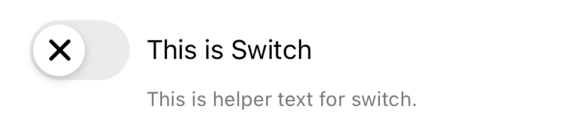
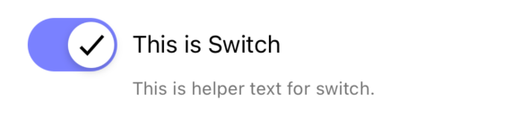

# Switch
<table >
   <tr>
      <td></td>
      <td></td>
  </tr>
</table>

## Usage

```js
import React, { useState } from 'react-native';
import { Switch } from '@pbsc/react-native-ui-components';

const [isOn, setIsOn] = useState(false);

// ...

const handleSwitchChange = (value) => {
    setIsOn(value);
};

// ...

<Switch
    label="This is Switch"
    isOn={isOn}
    onChange={handleSwitchChange}
    helperText="This is helper text for switch."
/>
```

## Props
### label
Type: string <br/>
The text to use for the label.

### isOn
Type: boolean <br/>
Whether the Swich is on or not. If `true` the Switch will be turned on

### onChange
Type: function <br/>
Callback that is called when the Switch's status changes. (on -> off or vice versa)

### helperText
Type: string <br/>
Text for additional info.

### disabled
Type: boolean <br/>
Default value: false <br/>
If `true`, user won't be able to interact with the component.

### width
Type: string/number <br/>
Default value: '80%' <br/>
Set the width of the Swicth including its label

### size
Type: number <br/>
Default value: 36
Set the size of the Switch

### labelColor
Type: hexColorCode (ex: #ff00ff) <br/>
Default value: #000000 <br/>
Label's color

### onColor
Type: hexColorCode (ex: #ff00ff) <br/>
Default value: #7a81ff <br/>
Background color when the Switch is on

### offColor
Type: hexColorCode (ex: #ff00ff) <br/>
Default value: #ebebeb <br/>
Background color when the Switch is off

### wheelColor
Type: hexColorCode (ex: #ff00ff) <br/>
Default value: #ffffff <br/>
Color for the wheel of the Switch

### checkmarkColor
Type: hexColorCode (ex: #ff00ff) <br/>
Default value: #ffffff <br/>
Checkmark's color

### iconForOn
Type: string <br/>
Default value = 'checkmark-sharp'<br/>
Name of the icon to show on the wheel of the Switch when it's on.  Material community icon name can be used.

### iconForOff
Type: string <br/>
Default value = 'close'<br/>
Name of the icon to show on the wheel of the Switch when it's off.  Material community icon name can be used.

### style
Type: object <br/>
Set style of switch part

### labelStyle
Type: object <br/>
Set style of label part

### helperTextStyle
Type: object <br/>
Set style of helper text part
