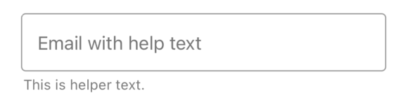
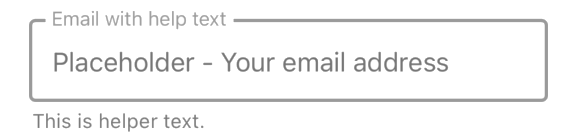
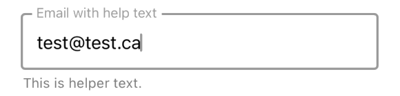
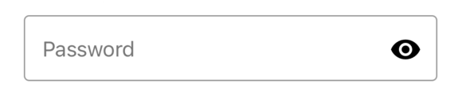
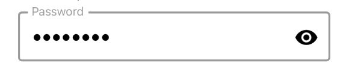
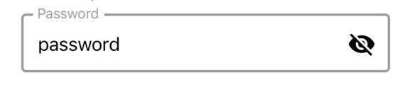
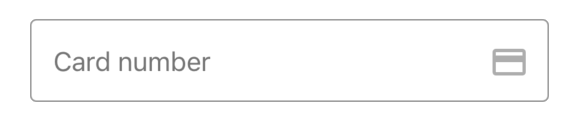
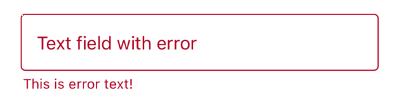
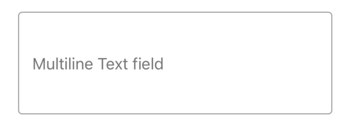

# TextField
- TextField with Helper Text
<table >
   <tr>
      <td></td>
      <td></td>
      <td></td>
  </tr>
</table>

- TextField for password
<table >
   <tr>
      <td></td>
      <td></td>
      <td></td>
  </tr>
</table>

- Other examples
<table >
   <tr>
      <td></td>
      <td></td>
      <td></td>
  </tr>
</table>

## Usage

```js
import { TextField} from '@pbsc/react-native-ui-components';

// ...

<TextField
    label="Email"
    placeholder="Your email address"
    keyboardType="email-address"
    autoCapitalize="none"
    helperText="This is helper text."
    value={text}
/>
```

## Props
### label
Type: string <br/>
The text to use for the floating label.

### value
Type: string <br/>
The value to show for the TextField.

### placeholder
Type: string <br/>
Placeholder for the TextField.

### password
Type: boolean <br/>
Default value: false <br/>
Can be used as password field when this value is true.

### rightIconName
Type: string <br/>
Name of the icon to show on the right side of the TextField.  Material community icon name can be used.

### onPressRightIcon
Type: function <br/>
Function to execute when right icon is clicked.

### hasError
Type: boolean <br/>
Default value: false <br/>
When it is `true`, the Textfield shows up with error style. (The color of the TextField and its helper text turns to error color)

### errorColor
Type: hexColorCode (ex: #ff00ff) <br/>
Default value: #b00020 <br/>
Color for error state

### helperText
Type: string <br/>
Text for additional info.  Can be used to show error message with `hasError` prop.

### keyboardType
Type: enum(string) <br/>
Default value: `default` <br/>
Determines which keyboard to open. <br/>
The following values work across platforms:
- `default`
- `number-pad`
- `decimal-pad`
- `numeric`
- `email-address`
- `phone-pad`
- `url`

### autoCapitalize
Type: enum(string) <br>
Default value: `sentence`<br/>
Tells TextField to automatically capitalize certain characters. This property is not supported by some keyboard types such as phone-pad.

- `characters`: all characters.
- `words`: first letter of each word.
- `sentences`: first letter of each sentence
- `none`: don't auto capitalize anything.

### autoComplete
Type: emum(string) <br/>
Specifies autocomplete hints for the system, so it can provide autofill. On Android, the system will always attempt to offer autofill by using heuristics to identify the type of content (Android only). To disable autocomplete, set `autoComplete` to `off`. <br/>
Possible values for autoComplete are:
- `birthdate-day`
- `birthdate-full`
- `birthdate-month`
- `birthdate-year`
- `cc-csc`
- `cc-exp`
- `cc-exp-day`
- `cc-exp-month`
- `cc-exp-year`
- `cc-number`
- `email`
- `gender`
- `name`
- `name-family`
- `name-given`
- `name-middle`
- `name-middle-initial`
- `name-prefix`
- `name-suffix`
- `password`
- `password-new`
- `postal-address`
- `postal-address-country`
- `postal-address-extended`
- `postal-address-extended-postal-code`
- `postal-address-locality`
- `postal-address-region`
- `postal-code`
- `street-address`
- `sms-otp`
- `tel`
- `tel-country-code`
- `tel-national`
- `tel-device`
- `username`
- `username-new`
- `off`

### onChangeText
Type: Function <br/>
Callback that is called when the TextField's text changes. Changed text is passed as an argument to the callback handler.

### onSubmitEditing
Type: Function <br/>
Callback that is called when the TextField's submit button (enter button on the keyboard) is pressed.

### onBlur
Type: Function <br/>
Callback that is called when the TextField is blurred.

### onFocus
Type: Function <br/>
Callback that is called when the TextField is focused.

### disabled
Type: boolean
Default value: false
If true, user won't be able to interact with the component.

### editable
Type: boolean <br/>
Default value: true <br/>
If false, text is not editable.

### maxLength
Type: number <br/>
Limits the maximum number of characters that can be entered.

### multiLine
Type: boolean <br/>
Default value: false
If `true`, the TextField can be multiple lines. <br/>
This aligns the text to the top on iOS, and centers it on Android. Use with textAlignVertical set to top for the same behavior in both platforms.

### width
Type: string/number <br/>
Default value: '80%' <br/>
Set the width of the TextField

### height
Type: string/number <br/>
Default value: 48
Set the height of the TextField

### activeColor
Type: hexColorCode (ex: #ff00ff) <br/>
Default value: #9a9a9a <br/>
Outline color when it is active (focused)

### inactiveColor
Type: hexColorCode (ex: #ff00ff) <br/>
Default value: #9a9a9a <br/>
Outline color when it is inactive (blurred)

### backgroundColor
Type: hexColorCode (ex: #ff00ff) <br/>
Default value: #ffffff <br/>
Background color

### textColor
Type: hexColorCode (ex: #ff00ff) <br/>
Default value: #000000 <br/>
Text color

### style
Type: object <br/>
Set style of the container part

### textInputStyle
Type: object <br/>
Set style of text input part

### helperTextStyle
Type: object <br/>
Set style of helper text part
