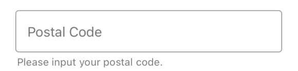
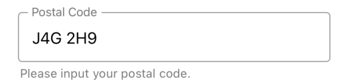
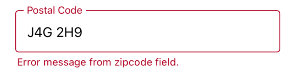
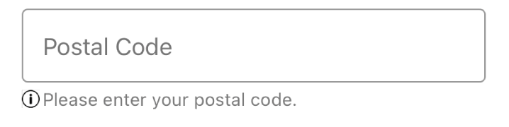

# ZipcodeField
<table >
   <tr>
      <td></td>
      <td></td>
      <td></td>
      <td></td>
  </tr>
</table>

## Usage

```js
import React, { useState } from 'react';
import { ZipcodeField } from '@pbsc/react-native-ui-components';

// ...

const [postalCode, setPostalCode] = useState('');

const handlePostalcodeSubmit = (value) => {
    setPostalCode(value);
    console.log(`PostalCode: ${value}`);
};

// ...

<ZipcodeField
    label="Postal Code"
    country="ca"
    onSubmitEditing={handlePostalcodeSubmit}
    helperText="Please input your postal code."
    hasHelperTextIcon={true}
        helperTextCustomIcon={
        <Image
            source={require('../images/info.png')}
            style={{ width: 12, height: 12 }}

        />
        }
/>
```

## Props
### label
Type: string <br/>
The text to use for the floating label.

### value
Type: string <br/>
The value to show for the ZipcodeField.

### placeholder
Type: string <br/>
Placeholder for the TextField.

### country
Type: string <br/>
Default value: 'CA' <br/>
The country code for the zip code field. Changes maximum length of input text. Value needs to follow <a href='https://en.wikipedia.org/wiki/ISO_3166-1_alpha-2'>`ISO 3166-1 alpha-2`</a>.

### hasError
Type: boolean <br/>
Default value: false <br/>
When it is `true`, the ZipcodeField shows up with error style. (The color of the TextField and its helper text turns to error color)

### errorColor
Type: hexColorCode (ex: #ff00ff) <br/>
Default value: #b00020 <br/>
Color for error state

### helperText
Type: string <br/>
Text for additional info. Can be used to show error message with `hasError` prop.

### onChangeText
Type: Function <br/>
Callback that is called when the ZipcodeField's text changes. Changed text is passed as an argument to the callback handler.

### onSubmitEditing
Type: Function <br/>
Callback that is called when the ZipcodeField's submit button (enter button on the keyboard) is pressed.

### onBlur
Type: Function <br/>
Callback that is called when the ZipcodeField is blurred.

### onFocus
Type: Function <br/>
Callback that is called when the ZipcodeField is focused.

### disabled
Type: boolean <br/>
Default value: false <br/>
If true, user won't be able to interact with the component.

### editable
Type: boolean <br/>
Default value: true <br/>
If false, text is not editable.

### width
Type: string/number <br/>
Default value: '80%' <br/>
Set the width of the TextField

### height
Type: string/number <br/>
Default value: 48
Set the height of the TextField

### activeColor
Type: hexColorCode (ex: #ff00ff) <br/>
Default value: #9a9a9a <br/>
Outline color when it is active (focused)

### inactiveColor
Type: hexColorCode (ex: #ff00ff) <br/>
Default value: #9a9a9a <br/>
Outline color when it is inactive (blurred)

### backgroundColor
Type: hexColorCode (ex: #ff00ff) <br/>
Default value: #ffffff <br/>
Background color

### textColor
Type: hexColorCode (ex: #ff00ff) <br/>
Default value: #000000 <br/>
Text color

### style
Type: object <br/>
Set style of the container part

### textInputStyle
Type: object <br/>
Set style of text input part

### helperTextStyle
Type: object <br/>
Set style of helper text part

### hasHelperTextIcon
Type: boolean <br/>
Enable custom component (ex: helperTextCustomIcon) to place before helperText

### helperTextCustomIcon
Type: jsx component <br/>
A custom component (usually svg component or Image) to place icon before helperText and can be used for errors as well.
